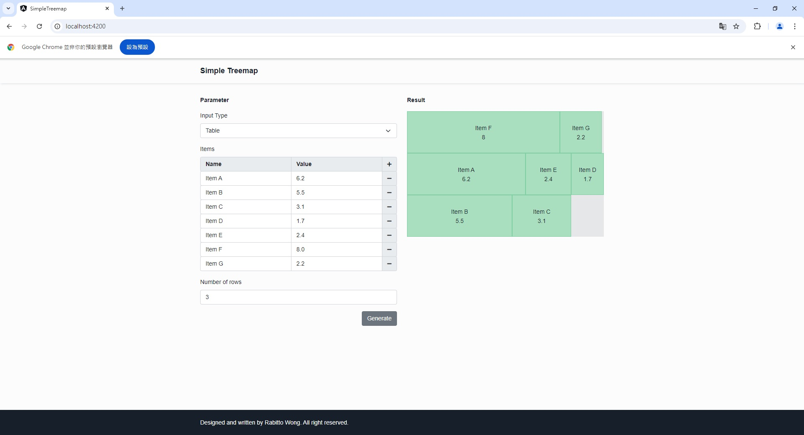

# Simple Treemap Generator

## Overview

This project is an Angular-based web application designed to generate a simple treemap with customized inputs. The application supports both JSON and table formats as input, and assumes that all items in the treemap have the same height.

## Features

1. **Simple Treemap Generation**

   The application generates a basic treemap layout where the height of all items is uniform, providing a clear visual representation of hierarchical data.

2. **Customizable Input**

   Users can input data in either JSON or table format, which will be processed to create the treemap.

3. **Uniform Height Assumption**

   All items in the treemap have the same height to simplify layout and improve readability.

## Installation

1. Clone the repository:

   ```bash
   git clone <repository-url>
   cd <project-directory>
   ```

2. Install dependencies:

   ```bash
   npm install
   ```

3. Run the Angular application:

   ```bash
   ng serve
   ```

4. Access the application in your browser:

   ```bash
   http://localhost:4200
   ```

## Usage

1. Input data as a hierarchical JSON structure; Or
2. Input data in a tabular format
3. Click `Generate`, application will use the input data to build a treemap

## Demo



## Important Notes

- The application assumes that all items in the treemap have equal heights, making it easier to represent hierarchical data visually
- Ensure the input data is properly formatted to avoid errors in treemap generation

## Disclaimer

This project is intended for educational and research purposes only. Users should ensure compliance with all applicable laws and regulations when utilizing this software.
